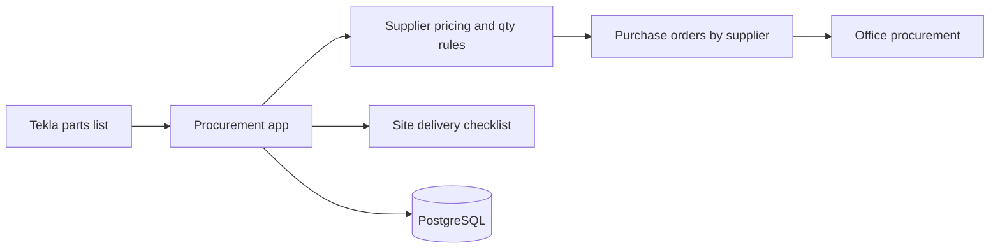

# Shed House Australia — Project Procurement Platform

**Client:** Shed House Australia  
**Type:** Project-based procurement platform  
**Role:** Full-stack engineer

> Case study only — proprietary application source is not published here.

## Problem

Each shed starts as an engineering design in Tekla, which produces the complete list of required parts. Staff previously had to interpret that list, match suppliers, apply pricing and quantity rules, and create purchase orders manually across email and spreadsheets.

## Solution

A platform that turns engineering information into a structured procurement workflow: identify materials, apply supplier pricing and quantity rules, generate supplier-specific purchase orders, and track what has been received per project.

**End-to-end flow:**

```text
Engineering requirements → Supplier & pricing rules → Procurement quantities → Purchase orders → Delivery tracking
```

### What this solved

- Removed manual matching of parts lists to supplier prices
- Removed manual purchase order creation — orders generated automatically, split and totalled per supplier
- Single source of truth for ordered vs delivered, per project
- Kept pricing hidden from field staff while still giving them a clear delivery checklist

## Architecture (high level)



## Tech stack

| Layer | Technologies |
|-------|----------------|
| Frontend | React, Vite, TypeScript, Redux Toolkit, Tailwind |
| Backend | Django, Django REST Framework, JWT, PostgreSQL |
| API | OpenAPI / Swagger |
| Infra | Docker, Gunicorn, Axios |

## Related public artifact

- [sha-tekla-files](https://github.com/Azhar-Sharif/sha-tekla-files) — related Tekla file handling work (non-sensitive utilities)

## Related

- Profile: [Azhar-Sharif](https://github.com/Azhar-Sharif)
